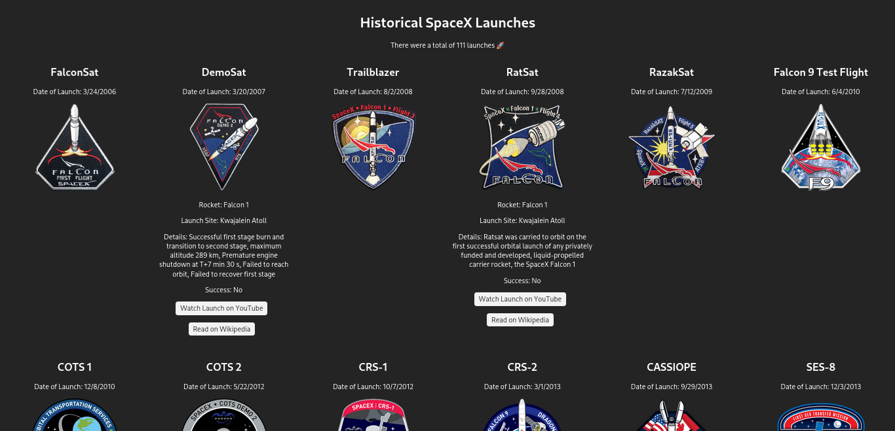

# SpaceX Historical Launches Viewer

[View live webpage here](https://frank-monkey.github.io/spacex-historical-launches/)

This is a React web application that allows users to explore historical SpaceX rocket launches. The app fetches data from the SpaceX Data API and provides a user-friendly interface to view details on each mission.

## Features
- List of upcoming launches with mission name, rocket name, launch site, and date.
- Master/detail view to display comprehensive mission details.
- Launch details include success status, mission details, and links to watch on YouTube and read on Wikipedia (if available).
- Automatic image resizing and fallback mechanism for mission patch images.
- Responsive CSS design for optimal viewing on various devices.

## Acknowledgements
- Thanks to SpaceX for providing the free API.
- Thanks to Github pages for providing the free hosting.